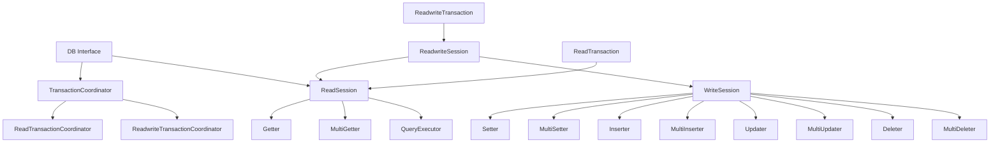

# Core Interfaces

This document describes the fundamental interfaces that define DALgo's abstraction layer.

## Table of Contents

- [DB Interface](#db-interface)
- [Record Interface](#record-interface)
- [Key Structure](#key-structure)
- [Session Interfaces](#session-interfaces)
- [Transaction Interfaces](#transaction-interfaces)
- [Adapter Interface](#adapter-interface)
- [Schema Interface](#schema-interface)

---

## DB Interface

The `dal.DB` interface is the primary entry point for all database operations.

```go
type DB interface {
    // ID returns a unique identifier for this database instance
    ID() string
    
    // Adapter provides information about the underlying database client
    Adapter() Adapter
    
    // Schema provides schema mapping rules (key to columns)
    Schema() Schema
    
    // Transaction coordinators
    TransactionCoordinator
    
    // Direct read operations (opens virtual session per call)
    ReadSession
}
```

### Key Methods

#### Read Operations

```go
// Get a single record by key
err := db.Get(ctx, record)

// Get multiple records by keys
err := db.GetMulti(ctx, records)

// Check if a record exists
exists, err := db.Exists(ctx, key)

// Execute a query
reader, err := db.ExecuteQueryToRecordsReader(ctx, query)
```

#### Write Operations (in Transactions)

Write operations should be executed within transactions:

```go
err := db.RunReadwriteTransaction(ctx, func(ctx context.Context, tx dal.ReadwriteTransaction) error {
    return tx.Set(ctx, record)
})
```

---

## Record Interface

The `Record` interface is the gateway to a database record.

```go
type Record interface {
    // Key returns the record's key (collection + ID + parent)
    Key() *Key
    
    // Data returns the record's data (without key)
    // Panics if called before Get or Set operation
    Data() any
    
    // Exists indicates if the record was found in the database
    // Panics if called before Get or Set operation
    Exists() bool
    
    // Error returns any error associated with this record
    Error() error
    
    // SetError sets error for the record (used by adapters)
    SetError(err error) Record
    
    // HasChanged indicates if the record has been modified
    HasChanged() bool
    
    // MarkAsChanged marks the record as changed
    MarkAsChanged()
}
```

### Record Creation Patterns

#### With Complete Key and Data

```go
key := dal.NewKeyWithID("users", "user123")
user := &User{Name: "Alice", Email: "alice@example.com"}
record := dal.NewRecordWithData(key, user)
```

#### With Incomplete Key (for queries)

```go
// For queries where ID is not known in advance
record := dal.NewRecordWithIncompleteKey("users", reflect.String, &User{})
```

#### Key Only (for existence checks or deletes)

```go
key := dal.NewKeyWithID("users", "user123")
record := dal.NewRecord(key)
```

### Record State Management

Records track their state through operations:

```go
// After Get operation
err := db.Get(ctx, record)
if err != nil && !dal.IsNotFound(err) {
    // Handle actual error
}

if record.Exists() {
    // Record was found
    user := record.Data().(*User)
    fmt.Println(user.Name)
} else {
    // Record not found
    fmt.Println("User does not exist")
}

// Check for errors
if err := record.Error(); err != nil {
    // Handle error
}
```

---

## Key Structure

The `Key` represents a full path to a record in the database.

```go
type Key struct {
    parent     *Key          // Optional parent key (for hierarchical data)
    collection string        // Collection/table name
    ID         any           // Record ID (comparable type)
    IDKind     reflect.Kind  // Type of ID (for incomplete keys)
}
```

### Key Creation

#### Simple Keys

```go
// String ID
key := dal.NewKeyWithID("users", "user123")

// Integer ID
key := dal.NewKeyWithID("posts", 42)

// Composite key with multiple fields
fields := []dal.FieldVal{
    {Name: "tenant_id", Value: "tenant1"},
    {Name: "user_id", Value: "user123"},
}
key := dal.NewKeyWithFields("users", fields...)
```

#### Hierarchical Keys

```go
// Create parent key
teamKey := dal.NewKeyWithID("teams", "team456")

// Create child key with parent
memberKey := dal.NewKeyWithParentAndID(teamKey, "members", "member789")

// Path: teams/team456/members/member789
fmt.Println(memberKey.String())
```

#### Incomplete Keys

Used when the ID will be generated or determined later:

```go
// For auto-generated IDs
key := dal.NewIncompleteKey("users", reflect.String, nil)

// ID will be set during Insert operation
```

### Key Methods

```go
// Get the collection name
collection := key.Collection()

// Get the parent key (may be nil)
parent := key.Parent()

// Get hierarchical level (0 for root)
level := key.Level()

// Get full path as string
path := key.String() // e.g., "teams/team456/members/member789"

// Get collection path
collPath := key.CollectionPath() // e.g., "teams/members"

// Validate the key
err := key.Validate()

// Compare keys
equal := key1.Equal(key2)
```

---

## Session Interfaces

Sessions define the operations available for reading and writing data.

### ReadSession

```go
type ReadSession interface {
    Getter        // Get single record
    MultiGetter   // Get multiple records
    QueryExecutor // Execute queries
}

type Getter interface {
    Get(ctx context.Context, record Record) error
    Exists(ctx context.Context, key *Key) (bool, error)
}

type MultiGetter interface {
    GetMulti(ctx context.Context, records []Record) error
}

type QueryExecutor interface {
    ExecuteQueryToRecordsReader(ctx context.Context, query Query) (RecordsReader, error)
    ExecuteQueryToRecordsetReader(ctx context.Context, query Query, 
        options ...recordset.Option) (RecordsetReader, error)
}
```

### WriteSession

```go
type WriteSession interface {
    Setter        // Set single record
    MultiSetter   // Set multiple records
    Inserter      // Insert single record
    MultiInserter // Insert multiple records
    Updater       // Update single record
    MultiUpdater  // Update multiple records
    Deleter       // Delete single record
    MultiDeleter  // Delete multiple records
}
```

### ReadwriteSession

Combines read and write capabilities:

```go
type ReadwriteSession interface {
    ReadSession
    WriteSession
}
```

---

## Transaction Interfaces

Transactions provide atomic, consistent, isolated, and durable operations.

### TransactionCoordinator

```go
type TransactionCoordinator interface {
    ReadTransactionCoordinator
    ReadwriteTransactionCoordinator
}

type ReadTransactionCoordinator interface {
    RunReadonlyTransaction(ctx context.Context, f ROTxWorker, 
        options ...TransactionOption) error
}

type ReadwriteTransactionCoordinator interface {
    RunReadwriteTransaction(ctx context.Context, f RWTxWorker, 
        options ...TransactionOption) error
}
```

### Transaction Workers

```go
// Read-only transaction worker
type ROTxWorker = func(ctx context.Context, tx ReadTransaction) error

// Read-write transaction worker
type RWTxWorker = func(ctx context.Context, tx ReadwriteTransaction) error
```

### Transaction Types

```go
type ReadTransaction interface {
    Transaction
    ReadSession
}

type ReadwriteTransaction interface {
    Transaction
    ReadwriteSession
    ID() string // Returns transaction ID if supported
}

type Transaction interface {
    Options() TransactionOptions
}
```

See [Transactions](transactions.md) for detailed transaction patterns.

---

## Adapter Interface

The `Adapter` interface describes the database client being used.

```go
type Adapter interface {
    // Name of the adapter (e.g., "firestore", "postgres", "mysql")
    Name() string
    
    // Version of the adapter
    Version() string
}

// Create an adapter
adapter := dal.NewAdapter("postgres", "1.0.0")
```

### Standard Adapter Names

| Name | Description |
|------|-------------|
| `firestore` | Google Cloud Firestore |
| `datastore` | Google Cloud Datastore |
| `postgres` | PostgreSQL database |
| `mysql` | MySQL database |
| `mssql` | Microsoft SQL Server |
| `sqlite` | SQLite database |
| `fs` | File system adapter |
| `git` | Git repository adapter |
| `badger` | BadgerDB (embedded KV store) |
| `buntdb` | BuntDB (embedded KV store) |

---

## Schema Interface

The `Schema` interface bridges the gap between key-value and relational databases.

```go
type Schema interface {
    // DataToKey creates a key from data read from the database
    // Used when reading from relational databases
    DataToKey(incompleteKey *Key, data any) (key *Key, err error)
    
    // KeyToFields maps key fields into the data structure
    // Used when writing to relational databases
    KeyToFields(key *Key, data any) (fields []ExtraField, err error)
}
```

### Function Types

```go
// DataToKeyFunc extracts key from data
type DataToKeyFunc func(incompleteKey *Key, data any) (key *Key, err error)

// KeyToFieldsFunc injects key into data or returns extra fields
type KeyToFieldsFunc func(key *Key, data any) (fields []ExtraField, err error)
```

### Creating a Schema

```go
// For key-value stores (key separate from data)
schema := dal.NewSchema(
    nil, // No KeyToFields mapping needed
    nil, // No DataToKey mapping needed
)

// For relational databases (key columns part of data)
schema := dal.NewSchema(
    func(key *Key, data any) ([]dal.ExtraField, error) {
        // Map key ID to a field
        return []dal.ExtraField{
            {Name: "id", Value: key.ID},
        }, nil
    },
    func(incompleteKey *Key, data any) (*Key, error) {
        // Extract ID from data
        user := data.(*User)
        return dal.NewKeyWithID(incompleteKey.Collection(), user.ID), nil
    },
)
```

See [Schema Handling](schema.md) for detailed examples.

---

## Interface Composition

DALgo's interfaces compose naturally:



---

## Next Steps

- Learn about [Record Management](records.md) for working with data
- See [Transactions](transactions.md) for transaction patterns
- Read [Database Adapters](adapters.md) to implement your own adapter
- Check [Examples](examples.md) for complete usage patterns
