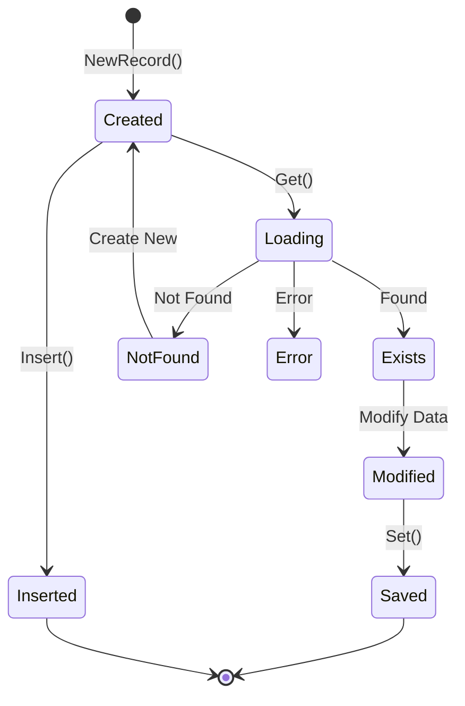

# Record Management

This document covers working with records, keys, and strongly typed data in DALgo.

## Table of Contents

- [Record Lifecycle](#record-lifecycle)
- [Key Management](#key-management)
- [Strongly Typed Records](#strongly-typed-records)
- [Record State](#record-state)
- [Multi-Record Operations](#multi-record-operations)
- [Hierarchical Data](#hierarchical-data)
- [Best Practices](#best-practices)

---

## Record Lifecycle

A record goes through several states during its lifecycle:



### Creating Records

```go
// 1. Record with data (for Set operations)
key := dal.NewKeyWithID("users", "user123")
user := &User{Name: "Alice", Email: "alice@example.com"}
record := dal.NewRecordWithData(key, user)

// 2. Record without data (for Get operations)
key := dal.NewKeyWithID("users", "user123")
record := dal.NewRecord(key)

// 3. Record with incomplete key (for query results)
record := dal.NewRecordWithIncompleteKey("users", reflect.String, &User{})

// 4. Record without any key (unusual, for special cases)
record := dal.NewRecordWithoutKey(&User{})
```

### Reading Records

```go
// Prepare record for reading
key := dal.NewKeyWithID("users", "user123")
user := &User{}
record := dal.NewRecordWithData(key, user)

// Fetch from database
err := db.Get(ctx, record)
if err != nil && !dal.IsNotFound(err) {
    return fmt.Errorf("failed to get user: %w", err)
}

// Check existence and access data
if record.Exists() {
    fmt.Printf("User: %s (%s)\n", user.Name, user.Email)
} else {
    fmt.Println("User not found")
}
```

### Writing Records

```go
// Create new record
user := &User{Name: "Bob", Email: "bob@example.com"}
key := dal.NewKeyWithID("users", "user456")
record := dal.NewRecordWithData(key, user)

// Save to database (creates or overwrites)
err := db.RunReadwriteTransaction(ctx, func(ctx context.Context, tx dal.ReadwriteTransaction) error {
    return tx.Set(ctx, record)
})
```

### Inserting Records

Insert ensures the record doesn't already exist:

```go
user := &User{Name: "Charlie", Email: "charlie@example.com"}
key := dal.NewKeyWithID("users", "user789")
record := dal.NewRecordWithData(key, user)

err := db.RunReadwriteTransaction(ctx, func(ctx context.Context, tx dal.ReadwriteTransaction) error {
    return tx.Insert(ctx, record)
})
if err != nil {
    // Will fail if record already exists
}
```

### Inserting with Generated IDs

```go
user := &User{Name: "Diana", Email: "diana@example.com"}

// Create incomplete key (ID will be generated)
key := dal.NewIncompleteKey("users", reflect.String, nil)
record := dal.NewRecordWithData(key, user)

err := db.RunReadwriteTransaction(ctx, func(ctx context.Context, tx dal.ReadwriteTransaction) error {
    // Insert with ID generator
    return tx.Insert(ctx, record, dal.WithRandomStringID())
})

// After insert, key.ID contains the generated ID
generatedID := record.Key().ID.(string)
fmt.Printf("Generated ID: %s\n", generatedID)
```

---

## Key Management

Keys uniquely identify records in the database.

### Simple Keys

```go
// String ID
key := dal.NewKeyWithID("users", "user123")

// Integer ID
key := dal.NewKeyWithID("posts", 42)

// UUID ID
import "github.com/google/uuid"
id := uuid.New()
key := dal.NewKeyWithID("sessions", id)
```

### Composite Keys

For tables with multi-column primary keys:

```go
// Define composite key fields
fields := []dal.FieldVal{
    {Name: "tenant_id", Value: "tenant1"},
    {Name: "user_id", Value: "user123"},
}

// Create key with fields
key := dal.NewKeyWithFields("tenant_users", fields...)

// Key path: tenant_users/tenant1/user123
fmt.Println(key.String())
```

### Key Validation

```go
key := dal.NewKeyWithID("users", "user123")

// Validate key structure
if err := key.Validate(); err != nil {
    return fmt.Errorf("invalid key: %w", err)
}

// Keys validate automatically in NewRecord() and NewRecordWithData()
```

### Key Comparison

```go
key1 := dal.NewKeyWithID("users", "user123")
key2 := dal.NewKeyWithID("users", "user123")
key3 := dal.NewKeyWithID("users", "user456")

// Compare keys
if key1.Equal(key2) {
    fmt.Println("Keys are equal")
}

// Alternative comparison
if dal.EqualKeys(key1, key3) {
    fmt.Println("Keys are equal")
} else {
    fmt.Println("Keys are different")
}
```

### Key Properties

```go
key := dal.NewKeyWithID("users", "user123")

// Get collection name
collection := key.Collection() // "users"

// Get ID
id := key.ID // "user123"

// Get string representation
path := key.String() // "users/user123"

// Get collection path
collPath := key.CollectionPath() // "users"

// Get level (0 for root, increments for each parent)
level := key.Level() // 0
```

---

## Strongly Typed Records

The `record` package provides helpers for working with strongly typed records.

### WithID Helper

```go
import "github.com/dal-go/dalgo/record"

// Define your data type
type UserDto struct {
    Name  string
    Email string
}

// Define a type that embeds WithID
type User struct {
    record.WithID[string] // ID is string type
    Dto *UserDto
}

// Create a user instance
func NewUser(id string, dto *UserDto) User {
    key := dal.NewKeyWithID("users", id)
    return User{
        WithID: record.WithID[string]{
            ID:     id,
            Key:    key,
            Record: dal.NewRecordWithData(key, dto),
        },
        Dto: dto,
    }
}

// Usage
user := NewUser("user123", &UserDto{
    Name:  "Alice",
    Email: "alice@example.com",
})

// Access data in strongly typed way
fmt.Println(user.Dto.Name)   // No type assertion needed!
fmt.Println(user.ID)          // Direct ID access
fmt.Println(user.Key.String()) // Direct key access

// Use in database operations
err := db.Get(ctx, user.Record)
```

### DataWithID Helper

```go
import "github.com/dal-go/dalgo/record"

// Alternative: embed data directly
type User struct {
    record.DataWithID[string]
    Name  string
    Email string
}

func NewUser(id string) User {
    user := User{
        DataWithID: record.NewDataWithID("users", id),
        Name:       "Alice",
        Email:      "alice@example.com",
    }
    return user
}

// Usage
user := NewUser("user123")
err := db.Get(ctx, user.Record)
```

### WithRecordChanges Helper

Track changes to records:

```go
import "github.com/dal-go/dalgo/record"

type User struct {
    record.WithRecordChanges
    Name  string
    Email string
}

user := &User{Name: "Alice"}

// Mark fields as changed
user.RecordChanges().MarkAsChanged("Name")

// Check if specific field changed
if user.RecordChanges().HasChanged("Name") {
    fmt.Println("Name was changed")
}

// Get all changed fields
changes := user.RecordChanges().ChangedFields()
```

---

## Record State

Records maintain state information throughout their lifecycle.

### Existence State

```go
record := dal.NewRecord(key)

// Before Get/Set - will panic
// exists := record.Exists() // PANIC!

// After Get
err := db.Get(ctx, record)
if record.Exists() {
    fmt.Println("Record found")
} else {
    fmt.Println("Record not found")
}
```

### Error State

```go
record := dal.NewRecord(key)

// Get the record
err := db.Get(ctx, record)

// Check error from operation
if err != nil && !dal.IsNotFound(err) {
    return err
}

// Check error from record
if err := record.Error(); err != nil {
    return err
}
```

### Changed State

```go
record := dal.NewRecordWithData(key, user)

// Check if changed
if record.HasChanged() {
    fmt.Println("Record was modified")
}

// Mark as changed
record.MarkAsChanged()

// Use for conditional updates
if record.HasChanged() {
    err := db.Set(ctx, record)
}
```

### Accessing Data

```go
record := dal.NewRecordWithData(key, &User{})

// Before Get - will panic
// data := record.Data() // PANIC!

// After Get
err := db.Get(ctx, record)
if record.Exists() {
    // Safe to access data
    user := record.Data().(*User)
    fmt.Println(user.Name)
}
```

---

## Multi-Record Operations

DALgo provides efficient batch operations for multiple records.

### GetMulti

```go
// Prepare multiple records
keys := []string{"user1", "user2", "user3"}
records := make([]dal.Record, len(keys))

for i, id := range keys {
    key := dal.NewKeyWithID("users", id)
    records[i] = dal.NewRecordWithData(key, &User{})
}

// Fetch all at once
err := db.GetMulti(ctx, records)
if err != nil {
    return err
}

// Process results
for i, record := range records {
    if record.Exists() {
        user := record.Data().(*User)
        fmt.Printf("User %d: %s\n", i, user.Name)
    } else {
        fmt.Printf("User %d: not found\n", i)
    }
    
    // Check individual errors
    if err := record.Error(); err != nil {
        fmt.Printf("User %d: error: %v\n", i, err)
    }
}
```

### SetMulti

```go
users := []*User{
    {Name: "Alice", Email: "alice@example.com"},
    {Name: "Bob", Email: "bob@example.com"},
}

records := make([]dal.Record, len(users))
for i, user := range users {
    key := dal.NewKeyWithID("users", fmt.Sprintf("user%d", i))
    records[i] = dal.NewRecordWithData(key, user)
}

err := db.RunReadwriteTransaction(ctx, func(ctx context.Context, tx dal.ReadwriteTransaction) error {
    return tx.SetMulti(ctx, records)
})
```

### DeleteMulti

```go
keys := []*dal.Key{
    dal.NewKeyWithID("users", "user1"),
    dal.NewKeyWithID("users", "user2"),
    dal.NewKeyWithID("users", "user3"),
}

err := db.RunReadwriteTransaction(ctx, func(ctx context.Context, tx dal.ReadwriteTransaction) error {
    return tx.DeleteMulti(ctx, keys)
})
```

---

## Hierarchical Data

DALgo supports parent-child relationships through hierarchical keys.

### Creating Child Records

```go
// Create parent
teamKey := dal.NewKeyWithID("teams", "engineering")
team := &Team{Name: "Engineering"}
teamRecord := dal.NewRecordWithData(teamKey, team)

// Create child with parent reference
memberKey := dal.NewKeyWithParentAndID(teamKey, "members", "alice")
member := &Member{Name: "Alice", Role: "Engineer"}
memberRecord := dal.NewRecordWithData(memberKey, member)

// Save both
err := db.RunReadwriteTransaction(ctx, func(ctx context.Context, tx dal.ReadwriteTransaction) error {
    if err := tx.Set(ctx, teamRecord); err != nil {
        return err
    }
    return tx.Set(ctx, memberRecord)
})
```

### Querying Child Collections

```go
// Query all members of a team
teamKey := dal.NewKeyWithID("teams", "engineering")

query := dal.From(dal.CollectionRef{
    Path:   teamKey.String() + "/members",
    Parent: teamKey,
}).
    Limit(100).
    SelectIntoRecord(func() dal.Record {
        return dal.NewRecordWithIncompleteKey("members", reflect.String, &Member{})
    })

reader, err := db.ExecuteQueryToRecordsReader(ctx, query)
defer reader.Close()

for {
    record, err := reader.Next()
    if err == dal.ErrNoMoreRecords {
        break
    }
    member := record.Data().(*Member)
    fmt.Printf("Member: %s (%s)\n", member.Name, member.Role)
}
```

### Navigating Hierarchies

```go
memberKey := dal.NewKeyWithParentAndID(teamKey, "members", "alice")

// Get parent key
parent := memberKey.Parent() // teamKey

// Get hierarchy level
level := memberKey.Level() // 1 (root is 0)

// Get full path
path := memberKey.String() // "teams/engineering/members/alice"

// Get collection path
collPath := memberKey.CollectionPath() // "teams/members"
```

---

## Best Practices

### 1. Always Use Contexts

```go
// Good: propagate context from caller
func GetUser(ctx context.Context, db dal.DB, userID string) (*User, error) {
    key := dal.NewKeyWithID("users", userID)
    user := &User{}
    record := dal.NewRecordWithData(key, user)
    
    if err := db.Get(ctx, record); err != nil {
        return nil, err
    }
    return user, nil
}

// Bad: creating new context
func GetUser(db dal.DB, userID string) (*User, error) {
    ctx := context.Background() // Don't do this
    // ...
}
```

### 2. Check Errors Properly

```go
// Good: distinguish not-found from other errors
err := db.Get(ctx, record)
if err != nil && !dal.IsNotFound(err) {
    return fmt.Errorf("failed to get record: %w", err)
}

if record.Exists() {
    // Process existing record
} else {
    // Handle not found case
}

// Bad: treating not-found as error
err := db.Get(ctx, record)
if err != nil {
    return err // May fail unnecessarily when record doesn't exist
}
```

### 3. Use Strongly Typed Helpers

```go
// Good: strongly typed access
type User struct {
    record.WithID[string]
    Dto *UserDto
}
user := NewUser("user123", &UserDto{Name: "Alice"})
name := user.Dto.Name // No type assertion!

// Less ideal: type assertions everywhere
record := dal.NewRecordWithData(key, &UserDto{})
name := record.Data().(*UserDto).Name // Requires assertion
```

### 4. Validate Keys Early

```go
// Good: validate at creation
func NewUserKey(id string) (*dal.Key, error) {
    if id == "" {
        return nil, errors.New("user ID cannot be empty")
    }
    key := dal.NewKeyWithID("users", id)
    if err := key.Validate(); err != nil {
        return nil, fmt.Errorf("invalid key: %w", err)
    }
    return key, nil
}

// Bad: let invalid keys propagate
func GetUser(id string) {
    key := dal.NewKeyWithID("users", id) // May panic if id is invalid
    // ...
}
```

### 5. Use Batch Operations

```go
// Good: use GetMulti for multiple records
records := make([]dal.Record, len(userIDs))
for i, id := range userIDs {
    key := dal.NewKeyWithID("users", id)
    records[i] = dal.NewRecordWithData(key, &User{})
}
err := db.GetMulti(ctx, records)

// Bad: loop with individual Gets
for _, id := range userIDs {
    key := dal.NewKeyWithID("users", id)
    record := dal.NewRecordWithData(key, &User{})
    err := db.Get(ctx, record) // Many round trips!
}
```

---

## Next Steps

- See [Query Building](queries.md) for finding records
- Read [Transactions](transactions.md) for atomic operations
- Check [Schema Handling](schema.md) for key-column mapping
- Review [Examples](examples.md) for complete patterns
