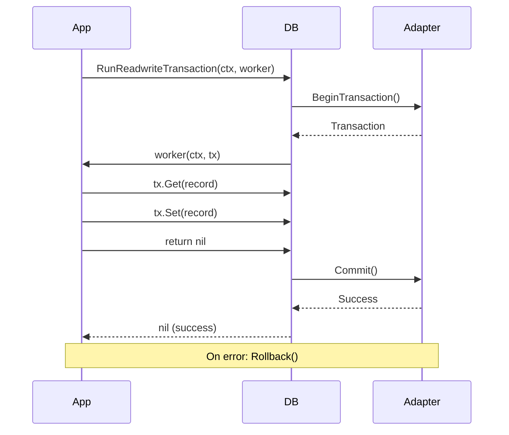

# Transactions

This document covers transaction patterns, isolation levels, and best practices in DALgo.

## Table of Contents

- [Transaction Basics](#transaction-basics)
- [Read-Only Transactions](#read-only-transactions)
- [Read-Write Transactions](#read-write-transactions)
- [Isolation Levels](#isolation-levels)
- [Transaction Options](#transaction-options)
- [Error Handling](#error-handling)
- [Best Practices](#best-practices)

---

## Transaction Basics

Transactions provide ACID guarantees:
- **Atomicity**: All operations succeed or all fail
- **Consistency**: Data remains in a valid state
- **Isolation**: Concurrent transactions don't interfere
- **Durability**: Committed changes persist

### Transaction Flow



### Why Use Transactions?

```go
// ❌ Without transaction: race condition possible
user := &User{}
record := dal.NewRecordWithData(key, user)
db.Get(ctx, record)
user.Balance += 100  // Another process might modify balance here
db.Set(ctx, record)  // Might overwrite other changes!

// ✅ With transaction: atomic operation
err := db.RunReadwriteTransaction(ctx, func(ctx context.Context, tx dal.ReadwriteTransaction) error {
    user := &User{}
    record := dal.NewRecordWithData(key, user)
    
    if err := tx.Get(ctx, record); err != nil {
        return err
    }
    
    user.Balance += 100  // Protected by transaction
    return tx.Set(ctx, record)
})
```

---

## Read-Only Transactions

Read-only transactions provide consistent snapshots of data.

### Basic Read-Only Transaction

```go
err := db.RunReadonlyTransaction(ctx, func(ctx context.Context, tx dal.ReadTransaction) error {
    // All reads see consistent snapshot
    record1 := dal.NewRecordWithData(key1, &User{})
    if err := tx.Get(ctx, record1); err != nil {
        return err
    }
    
    record2 := dal.NewRecordWithData(key2, &User{})
    if err := tx.Get(ctx, record2); err != nil {
        return err
    }
    
    // Both records are from the same consistent point in time
    return nil
})
```

### Read-Only with Query

```go
err := db.RunReadonlyTransaction(ctx, func(ctx context.Context, tx dal.ReadTransaction) error {
    query := dal.From(dal.CollectionRef{Name: "users"}).
        WhereField("status", dal.Equal, "active").
        SelectIntoRecord(recordFactory)
    
    reader, err := tx.ExecuteQueryToRecordsReader(ctx, query)
    if err != nil {
        return err
    }
    defer reader.Close()
    
    // Process results
    for {
        record, err := reader.Next()
        if err == dal.ErrNoMoreRecords {
            break
        }
        // Process record
    }
    
    return nil
})
```

### Multi-Record Consistent Read

```go
func GetRelatedData(ctx context.Context, db dal.DB, userID string) (*UserData, error) {
    var userData UserData
    
    err := db.RunReadonlyTransaction(ctx, func(ctx context.Context, tx dal.ReadTransaction) error {
        // Get user
        userKey := dal.NewKeyWithID("users", userID)
        userRecord := dal.NewRecordWithData(userKey, &userData.User)
        if err := tx.Get(ctx, userRecord); err != nil {
            return err
        }
        
        // Get user's posts (consistent with user data)
        query := dal.From(dal.CollectionRef{Name: "posts"}).
            WhereField("user_id", dal.Equal, userID).
            SelectIntoRecord(func() dal.Record {
                return dal.NewRecordWithIncompleteKey("posts", reflect.String, &Post{})
            })
        
        reader, err := tx.ExecuteQueryToRecordsReader(ctx, query)
        if err != nil {
            return err
        }
        defer reader.Close()
        
        userData.Posts = make([]*Post, 0)
        for {
            record, err := reader.Next()
            if err == dal.ErrNoMoreRecords {
                break
            }
            if err != nil {
                return err
            }
            post := record.Data().(*Post)
            userData.Posts = append(userData.Posts, post)
        }
        
        return nil
    })
    
    if err != nil {
        return nil, err
    }
    return &userData, nil
}
```

---

## Read-Write Transactions

Read-write transactions allow both reading and modifying data atomically.

### Basic Read-Write Transaction

```go
err := db.RunReadwriteTransaction(ctx, func(ctx context.Context, tx dal.ReadwriteTransaction) error {
    // Read
    record := dal.NewRecordWithData(key, &User{})
    if err := tx.Get(ctx, record); err != nil {
        return err
    }
    
    // Modify
    user := record.Data().(*User)
    user.LastLogin = time.Now()
    
    // Write
    return tx.Set(ctx, record)
})
```

### Transaction with Conditional Logic

```go
func TransferBalance(ctx context.Context, db dal.DB, fromID, toID string, amount float64) error {
    return db.RunReadwriteTransaction(ctx, func(ctx context.Context, tx dal.ReadwriteTransaction) error {
        // Get sender account
        fromKey := dal.NewKeyWithID("accounts", fromID)
        fromRecord := dal.NewRecordWithData(fromKey, &Account{})
        if err := tx.Get(ctx, fromRecord); err != nil {
            return fmt.Errorf("failed to get sender account: %w", err)
        }
        fromAccount := fromRecord.Data().(*Account)
        
        // Check sufficient balance
        if fromAccount.Balance < amount {
            return errors.New("insufficient balance")
        }
        
        // Get receiver account
        toKey := dal.NewKeyWithID("accounts", toID)
        toRecord := dal.NewRecordWithData(toKey, &Account{})
        if err := tx.Get(ctx, toRecord); err != nil {
            return fmt.Errorf("failed to get receiver account: %w", err)
        }
        toAccount := toRecord.Data().(*Account)
        
        // Update balances
        fromAccount.Balance -= amount
        toAccount.Balance += amount
        
        // Save both accounts (atomic)
        if err := tx.Set(ctx, fromRecord); err != nil {
            return fmt.Errorf("failed to update sender: %w", err)
        }
        if err := tx.Set(ctx, toRecord); err != nil {
            return fmt.Errorf("failed to update receiver: %w", err)
        }
        
        return nil
    })
}
```

### Insert in Transaction

```go
err := db.RunReadwriteTransaction(ctx, func(ctx context.Context, tx dal.ReadwriteTransaction) error {
    user := &User{
        Name:      "Alice",
        Email:     "alice@example.com",
        CreatedAt: time.Now(),
    }
    
    key := dal.NewKeyWithID("users", "user123")
    record := dal.NewRecordWithData(key, user)
    
    // Insert will fail if record already exists
    return tx.Insert(ctx, record)
})
```

### Update in Transaction

```go
err := db.RunReadwriteTransaction(ctx, func(ctx context.Context, tx dal.ReadwriteTransaction) error {
    key := dal.NewKeyWithID("users", "user123")
    
    // Partial update without reading full record
    updates := []update.Update{
        update.ByFieldName("last_login", time.Now()),
        update.ByFieldName("login_count", update.Increment(1)),
    }
    
    return tx.Update(ctx, key, updates)
})
```

### Delete in Transaction

```go
err := db.RunReadwriteTransaction(ctx, func(ctx context.Context, tx dal.ReadwriteTransaction) error {
    key := dal.NewKeyWithID("users", "user123")
    return tx.Delete(ctx, key)
})
```

### Batch Operations in Transaction

```go
err := db.RunReadwriteTransaction(ctx, func(ctx context.Context, tx dal.ReadwriteTransaction) error {
    // Create multiple records
    records := make([]dal.Record, 0, len(users))
    for i, user := range users {
        key := dal.NewKeyWithID("users", fmt.Sprintf("user%d", i))
        record := dal.NewRecordWithData(key, user)
        records = append(records, record)
    }
    
    // Save all at once
    return tx.SetMulti(ctx, records)
})
```

---

## Isolation Levels

DALgo supports multiple transaction isolation levels.

### Isolation Level Types

```go
const (
    TxUnspecified      // No isolation level specified
    TxChaos            // Prevents overwrites from higher isolated transactions
    TxReadUncommitted  // Dirty reads possible
    TxReadCommitted    // No dirty reads, but non-repeatable reads possible
    TxRepeatableRead   // No dirty or non-repeatable reads, but phantom reads possible
    TxSerializable     // Complete isolation, no anomalies
    TxSnapshot         // Snapshot isolation
)
```

### Setting Isolation Level

```go
err := db.RunReadwriteTransaction(ctx, 
    func(ctx context.Context, tx dal.ReadwriteTransaction) error {
        // Transaction code
        return nil
    },
    dal.TxWithIsolationLevel(dal.TxSerializable),
)
```

### Isolation Level Examples

#### Read Committed

Prevents dirty reads but allows non-repeatable reads:

```go
err := db.RunReadwriteTransaction(ctx,
    func(ctx context.Context, tx dal.ReadwriteTransaction) error {
        // First read
        record1 := dal.NewRecordWithData(key, &User{})
        tx.Get(ctx, record1)
        user1 := record1.Data().(*User)
        
        // Another transaction might modify this record here
        
        // Second read might see different data
        record2 := dal.NewRecordWithData(key, &User{})
        tx.Get(ctx, record2)
        user2 := record2.Data().(*User)
        
        // user1 and user2 might differ!
        return nil
    },
    dal.TxWithIsolationLevel(dal.TxReadCommitted),
)
```

#### Repeatable Read

Prevents dirty and non-repeatable reads:

```go
err := db.RunReadwriteTransaction(ctx,
    func(ctx context.Context, tx dal.ReadwriteTransaction) error {
        // Multiple reads of the same record will return the same data
        record1 := dal.NewRecordWithData(key, &User{})
        tx.Get(ctx, record1)
        
        // Even if another transaction modifies the record,
        // our subsequent reads will see the same data
        record2 := dal.NewRecordWithData(key, &User{})
        tx.Get(ctx, record2)
        
        // Guaranteed: record1 data == record2 data
        return nil
    },
    dal.TxWithIsolationLevel(dal.TxRepeatableRead),
)
```

#### Serializable

Complete isolation, as if transactions execute serially:

```go
err := db.RunReadwriteTransaction(ctx,
    func(ctx context.Context, tx dal.ReadwriteTransaction) error {
        // Complete isolation from all other transactions
        // No anomalies possible, but may have performance impact
        return nil
    },
    dal.TxWithIsolationLevel(dal.TxSerializable),
)
```

---

## Transaction Options

### Available Options

```go
// Set transaction name (useful for debugging/logging)
dal.TxWithName("user-update")

// Set isolation level
dal.TxWithIsolationLevel(dal.TxSerializable)

// Set number of retry attempts (for contention)
dal.TxWithAttempts(3)

// Mark as read-only (optimization hint)
dal.TxWithReadonly()

// Enable cross-group transactions (Google Datastore)
dal.TxWithCrossGroup()
```

### Combining Options

```go
err := db.RunReadwriteTransaction(ctx,
    func(ctx context.Context, tx dal.ReadwriteTransaction) error {
        // Transaction code
        return nil
    },
    dal.TxWithName("balance-transfer"),
    dal.TxWithIsolationLevel(dal.TxSerializable),
    dal.TxWithAttempts(3),
)
```

### Named Transactions

Useful for logging and debugging:

```go
err := db.RunReadwriteTransaction(ctx,
    func(ctx context.Context, tx dal.ReadwriteTransaction) error {
        options := tx.Options()
        log.Printf("Running transaction: %s", options.Name())
        return nil
    },
    dal.TxWithName("create-user-and-profile"),
)
```

### Retry Attempts

Some databases (like Google Datastore) support automatic retries:

```go
err := db.RunReadwriteTransaction(ctx,
    func(ctx context.Context, tx dal.ReadwriteTransaction) error {
        // This transaction may be retried up to 3 times
        // on contention or transient errors
        return nil
    },
    dal.TxWithAttempts(3),
)
```

---

## Error Handling

### Transaction Rollback

Transactions automatically rollback on error:

```go
err := db.RunReadwriteTransaction(ctx, func(ctx context.Context, tx dal.ReadwriteTransaction) error {
    // ... operations ...
    
    if someCondition {
        // Returning error triggers rollback
        return errors.New("condition not met")
    }
    
    // Returning nil commits the transaction
    return nil
})

if err != nil {
    // Transaction was rolled back
    log.Printf("Transaction failed: %v", err)
}
```

### Handling Not Found

```go
err := db.RunReadwriteTransaction(ctx, func(ctx context.Context, tx dal.ReadwriteTransaction) error {
    record := dal.NewRecordWithData(key, &User{})
    
    if err := tx.Get(ctx, record); err != nil {
        if dal.IsNotFound(err) {
            // Record doesn't exist, create it
            user := record.Data().(*User)
            user.Name = "New User"
            return tx.Insert(ctx, record)
        }
        return err // Other error
    }
    
    // Record exists, update it
    user := record.Data().(*User)
    user.LastSeen = time.Now()
    return tx.Set(ctx, record)
})
```

### Partial Success in Batch Operations

```go
err := db.RunReadwriteTransaction(ctx, func(ctx context.Context, tx dal.ReadwriteTransaction) error {
    records := []dal.Record{record1, record2, record3}
    
    if err := tx.GetMulti(ctx, records); err != nil {
        return err
    }
    
    // Check individual record errors
    for i, record := range records {
        if err := record.Error(); err != nil {
            if dal.IsNotFound(err) {
                log.Printf("Record %d not found", i)
                continue
            }
            return fmt.Errorf("error on record %d: %w", i, err)
        }
        
        // Process found record
        if record.Exists() {
            // ...
        }
    }
    
    return nil
})
```

### Rollback Errors

```go
err := db.RunReadwriteTransaction(ctx, func(ctx context.Context, tx dal.ReadwriteTransaction) error {
    // ... operations ...
    return someError
})

if err != nil {
    // Check if it's a rollback error
    if rbErr, ok := err.(interface {
        OriginalError() error
        RollbackError() error
    }); ok {
        log.Printf("Original error: %v", rbErr.OriginalError())
        log.Printf("Rollback error: %v", rbErr.RollbackError())
    }
}
```

---

## Best Practices

### 1. Keep Transactions Short

```go
// ✅ Good: minimal work in transaction
err := db.RunReadwriteTransaction(ctx, func(ctx context.Context, tx dal.ReadwriteTransaction) error {
    // Only database operations
    return tx.Set(ctx, record)
})

// ❌ Bad: long-running operations in transaction
err := db.RunReadwriteTransaction(ctx, func(ctx context.Context, tx dal.ReadwriteTransaction) error {
    // Don't do this!
    data := callExternalAPI() // Network call
    processData(data)          // CPU intensive
    return tx.Set(ctx, record)
})
```

### 2. Prepare Data Before Transaction

```go
// ✅ Good: prepare data first
user := &User{
    Name:  "Alice",
    Email: "alice@example.com",
}
validateUser(user) // Do this outside transaction

err := db.RunReadwriteTransaction(ctx, func(ctx context.Context, tx dal.ReadwriteTransaction) error {
    record := dal.NewRecordWithData(key, user)
    return tx.Set(ctx, record)
})

// ❌ Bad: preparation inside transaction
err := db.RunReadwriteTransaction(ctx, func(ctx context.Context, tx dal.ReadwriteTransaction) error {
    user := &User{}
    user.Email = normalizeEmail(email) // Do this outside!
    user.PasswordHash = hashPassword(password) // Expensive!
    record := dal.NewRecordWithData(key, user)
    return tx.Set(ctx, record)
})
```

### 3. Use Appropriate Isolation Level

```go
// Read-only: use snapshot or repeatable read
db.RunReadonlyTransaction(ctx, worker, dal.TxWithIsolationLevel(dal.TxSnapshot))

// Simple updates: read committed usually sufficient
db.RunReadwriteTransaction(ctx, worker, dal.TxWithIsolationLevel(dal.TxReadCommitted))

// Complex logic with multiple reads: repeatable read
db.RunReadwriteTransaction(ctx, worker, dal.TxWithIsolationLevel(dal.TxRepeatableRead))

// Critical operations: serializable
db.RunReadwriteTransaction(ctx, worker, dal.TxWithIsolationLevel(dal.TxSerializable))
```

### 4. Handle Contention

```go
// Use retries for high contention scenarios
err := db.RunReadwriteTransaction(ctx,
    func(ctx context.Context, tx dal.ReadwriteTransaction) error {
        // Hot record that many transactions modify
        return tx.Update(ctx, key, updates)
    },
    dal.TxWithAttempts(5), // Retry on contention
)
```

### 5. Don't Nest Transactions

```go
// ❌ Bad: nested transactions
err := db.RunReadwriteTransaction(ctx, func(ctx context.Context, tx dal.ReadwriteTransaction) error {
    // Don't start another transaction here!
    return db.RunReadwriteTransaction(ctx, func(ctx context.Context, tx2 dal.ReadwriteTransaction) error {
        return nil
    })
})

// ✅ Good: single transaction or separate transactions
err := db.RunReadwriteTransaction(ctx, func(ctx context.Context, tx dal.ReadwriteTransaction) error {
    // All operations in single transaction
    tx.Set(ctx, record1)
    tx.Set(ctx, record2)
    return nil
})
```

### 6. Use Context for Cancellation

```go
// ✅ Good: respect context cancellation
ctx, cancel := context.WithTimeout(context.Background(), 5*time.Second)
defer cancel()

err := db.RunReadwriteTransaction(ctx, func(ctx context.Context, tx dal.ReadwriteTransaction) error {
    // Transaction will be cancelled if context times out
    return tx.Set(ctx, record)
})
```

### 7. Log Transaction Boundaries

```go
err := db.RunReadwriteTransaction(ctx,
    func(ctx context.Context, tx dal.ReadwriteTransaction) error {
        log.Debug("Transaction started")
        defer log.Debug("Transaction ended")
        
        // Transaction operations
        
        return nil
    },
    dal.TxWithName("operation-name"),
)

if err != nil {
    log.Errorf("Transaction failed: %v", err)
} else {
    log.Info("Transaction committed")
}
```

---

## Next Steps

- See [Record Management](records.md) for data operations in transactions
- Read [Update Operations](updates.md) for partial updates
- Check [Error Handling](errors.md) for transaction error patterns
- Review [Examples](examples.md) for complete transaction examples
